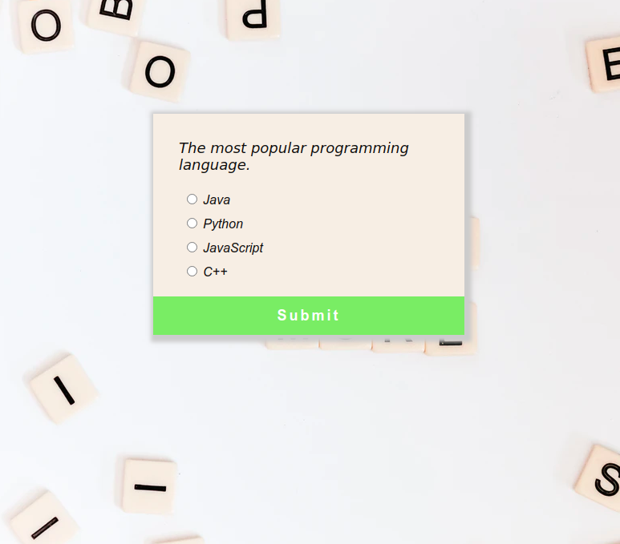

### 2. Quiz App

This is a simple quiz app that asks hardcoded questions and gives a score.
I made it using `Vanilla JavaScript` and basic `HTML`  and `CSS`.

The app was part of a commitment to make **100** `Vanilla JavaScript` projects.
This was the second project I made.

To run the app, just open the `index.html` file in your prefered browser.
